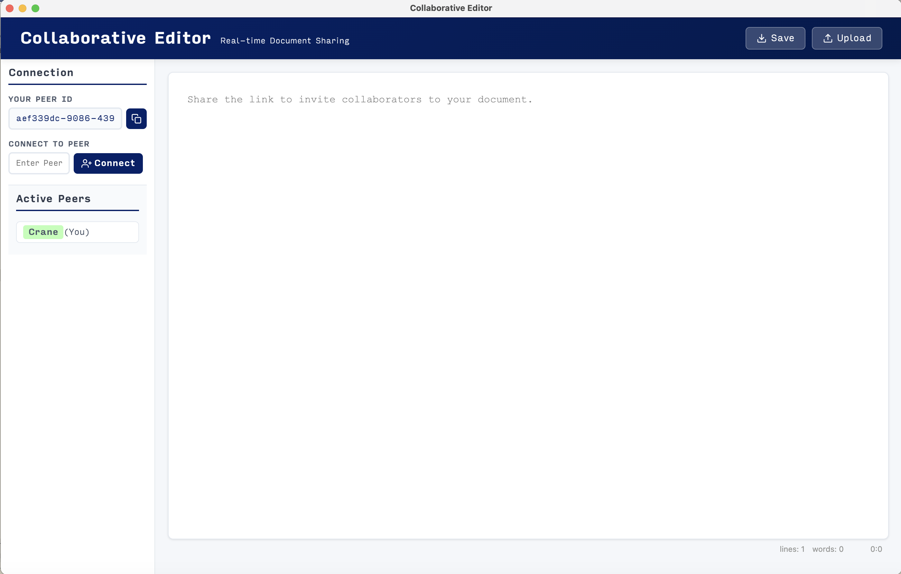

# Collaborative-Editor



# Overview

The project is based on conclave [https://github.com/conclave-team/conclave].


# Features

## Client-side technology to eliminate centralized web servers
We use electron to build the client-side application. And user could connect to the peer server through their peerjs ids rather than share the URL address.

## Video Chat
By utilizing client-side technology, we enabled WebRTC connections to bypass the browser's HTTPS security checks, thereby achieving the video calling functionality that was previously incomplete in the original project.

## Connection robustness
Extend the original project's connection robustness by keep redundant connections. And gossip the connection information to other peers.

# How to Run Locally

## Peerjs Server

Considering the unstable status of default peerjs server, we've added a new peerjs server. In the code, we just set the default peerjs server to our new server in duke vcm. I highly recommend using them. You could choose different peerjs server by modify the peerConfig.js file.

If you want to build and run your own peerjs server, you could use the following command:

```
docker build -f Dockerfile.peer -t my-peerjs-server .
docker run -d -p 9000:9000 --name running-peerjs my-peerjs-server
```

## Electron App

You will need node and npm. First download the dependencies.

```
npm install
```

Next, you will need to build and compile the assets and start the server. You can do that all in an npm command.

```
npm run electron
```

Then you could share the peerId with other users.
